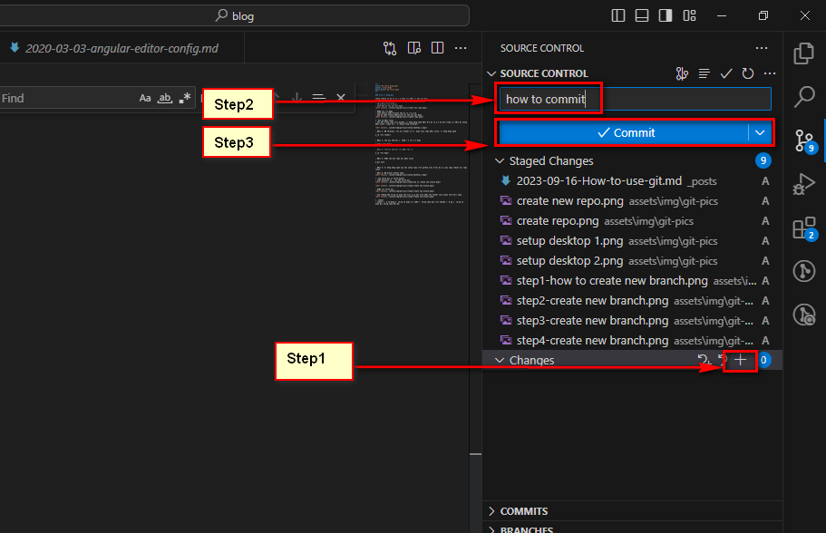

### Cách sử dụng git

Thông thường chúng ta sẽ làm theo các bước cơ bản sau đây:

1. Set up trên Github
- Mở github trên browser.
- Chọn New để tạo mới một Repo


- Nhập tên của Repo
- Chọn Public hoặc Private tùy dự án của mình
- Sau đó chọn Create Repository để tạo mới một Repo. 


2. Set up dưới local
- Sau khi setup repo trên github, sử dụng dòng lệnh dưới đây để tiến hành một trong các bước để setup dưới local. (copy nó và sử dụng trong terminal)


- Bước 1: Mở terminal, trỏ tới folder nơi mà muốn chứa repo dưới local, sử dụng dòng lệnh 
``` 
$ cd "tên folder".
```

- Bước 2: Tạo mới thư mục và nhập vào tên của Repo
```
$ mkdir "Tên Repo".
```

- Bước 3: Trở tới thư mục vừa được tạo ra
```
$ cd "Tên Repo".
```

- Bước 4: Khởi tạo một repo mới dưới local
```
$ git init
```

- Bước 5: Sử dụng dòng lệnh sau khi setup repo trên github (nêu trên) để kết nối repo remote với repo local.

- Bước 6: Mở Visual Studio Code.


3. Tạo nhánh mới từ nhánh master
- Chọn Checkout to... để tạo nhánh mới.


- Nhập tên nhánh mới.


- Cho trường hợp chúng ta muốn tạo trực tiếp một file hoặc tạo folder chứa nhiều file khác nhau.


4. Commit

Commit là hành động mà chúng ta muốn xác nhận là những thay đổi trên VSCode là đúng và chúng ta muốn giữ những thay đổi đó.

Chọn Source Control:
- Bước 1: chọn Changes. Click vào thư mục xuất hiện ở phần Changes để xem nhưng thay đổi khác so với trước đó.
- Bước 2: confirm ngắn gọn commit.
- Bước 3: Chọn Commit.
(Lưu ý: Trước khi commit chúng ta phải lưu lại tất cả các tab.)
